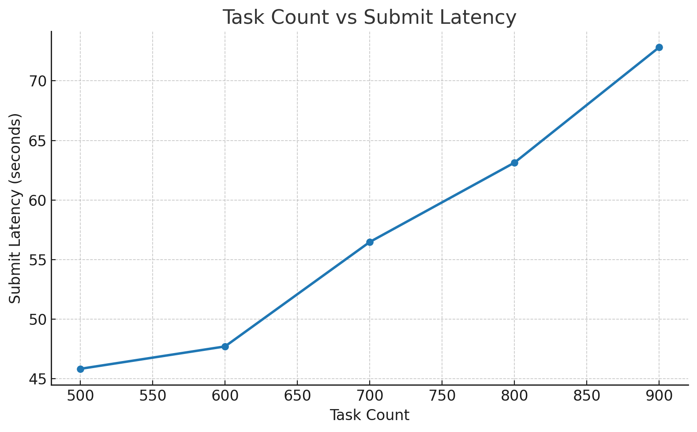
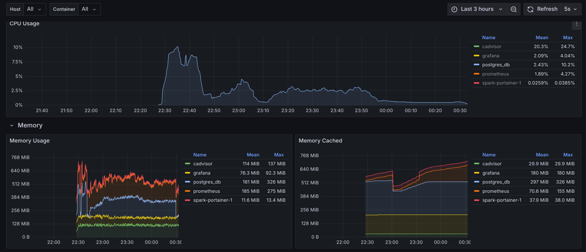
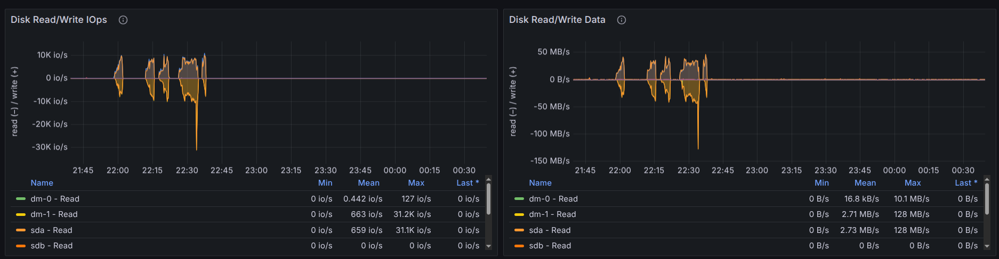

# Preload

### Simple task logging in prefect
In this way no work pool was used. Everything was executed in the application


## Using Workpool
Redis configed as broker and cache
PostgreSQL 13 configured as database 
This configuration for work pool and server worked for all the jos
```sh
# poll interval: 5
systemd-run  --scope   -p MemoryMax=8G -p CPUQuota=300% prefect worker start --pool 'test-pool'
systemd-run --scope -p MemoryMax=2400M -p CPUQuota=200%  prefect server start
```

Config used for prefect:
```sh
PREFECT_MESSAGING_BROKER=prefect_redis.messaging                                                     
PREFECT_MESSAGING_CACHE=prefect_redis.messaging                                                  
PREFECT_REDIS_MESSAGING_HOST=localhost
PREFECT_REDIS_MESSAGING_PORT=6379
PREFECT_REDIS_MESSAGING_DB=0
PREFECT_SERVER_EVENTS_MESSAGING_URL=redis://localhost:6379/0
PREFECT_API_URL=http://localhost:4200/api

PREFECT_API_REQUEST_TIMEOUT=120
PREFECT_SERVER_DATABASE_SQLALCHEMY_POOL_TIMEOUT=60
PREFECT_SERVER_DATABASE_SQLALCHEMY_POOL_SIZE=50
PREFECT_SERVER_DATABASE_SQLALCHEMY_MAX_OVERFLOW=30
PREFECT_SERVER_DATABASE_SQLALCHEMY_POOL_TIMEOUT=120
PREFECT_SERVER_DATABASE_TIMEOUT=30
PREFECT_SERVER_DATABASE_CONNECTION_TIMEOUT=10
```

#### Database max resource usage:
CPU: 10% of all 8vCPUs (0.8 vCPU)
RAM: 10


#### Disk usage
During running the test CPU was under pressure
Disk I/O: 1.2 kIO/s
Range of r/w: 20-50 MB/s
